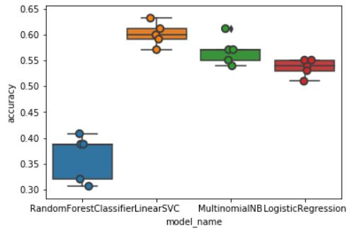

# Aplicación de clasificación de noticias

## Instrucciones
- Copiar noticia en campo de texto (está configurado para idioma español)
- Seleccionar el modelo (entre SVM, NaiveBayes, Logistic y Random Forest)
- Hacer click en "Predecir"
- Se presentará la etiqueta de la predicción en la sección "Clasificación"

## Etiquetas
- Tecnología: 0
- Entretenimiento: 1
- Deportes: 2
- Salud: 3
- Medio ambiente': 4
- Política: 5
- Ciencia: 6
 
 ## Precisión de los modelos:
 
 
 

Desplegado en: http://flask-heroku-jorgecif.herokuapp.com/

## Pasos deploy en Heroku con Flask

- Crear carpeta nueva
- Crear entorno virtual
  - Instalar virtualenv si no lo tengo: pip instal virtualenv
  -	Crear entorno: virtualenv [nombreentorno]
  -	Ejecutar entorno creado: . [nombreentorno]/Scripts/actívate
  -	Para manejar en vscode ir a command palette y abrir python interpreter para seleccionar el nuevo entorno (archivo Python.exe en carpeta creada del entorno)
- Instalar paquetes en mi entorno virtual
  -	Flask: pip install flask
  -	Gunicorn: pip install gunicorn
-	Ingresar a carpeta del entorno y creo carpeta de proyecto, ejemplo: Project
-	Crar el archivo Python: main.py
  -	Probar corriendo el archivo
  -	Cambiar el puerto de ser necesario por ejemplo a 5000 y la bandera debug en false
-	Crear archivo requirements.txt
  -	pip freeze (para ver listado de requerimientos)
  -	pip freeze > requirements.txt
-	Crear archivo Procfile
  -	web: gunicorn main:app
-	Deploy en heroku
  -	Instalar Heroku
  -	Login
    -	heroku login
  -	Crear aplicación
  -	Heroku create [nombre app] 
    -	Si entro a la aplicación y voy a pestaña “deploy” salen los comandos
-	Inicializar repositorio
  -	git init
  -	Apunto repositorio a aplicación en heroku
    -	heroku git:remote -a [nombre app] 
-	Deploy
  -	git add . 
  -	git commit -am “comentario”
  -	git push heroku master
- Abrir aplicación 
  -	heroku open
